#Android架构设计
@(Android)[架构, Clean Architecture, MVP, MVVM, MVC]

[TOC]


##前言

该文综合了Android架构设计的很多方面，参考了很多网络资源和开源项目，在这里深表感谢，不再一一列出。
本文的DEMO如下：https://github.com/xhrong/MvpDemo

由于内容较多，并存在冲突，DEMO和文章并不完全一致。

##Part1：基础组件
###RxJava&RxAndroid
函数式编程框架，能够将多层嵌套代码转化为链式函数调用。突出优化如下：
- 很好地解决了多线程中的回调或线程切换问题，能够以同步链式函数调用，实现线程切换和数据互传，不用在依赖Handler进行中转
- 函数式编程，代码简洁，思路清晰
- 配合Retrofit等库，能够实现非常清晰的架构设计
###Dagger
依赖注入框架，目前版本为Dagger2，由Google维护。通过生成代码的方式，性能较好。但是框架的抽象层次较高，入门困难，不建议在日常项目中使用。
###Retrofit
基于注解的网络请求库，能够自动完成数据->对象的映射。底层请求基于okHttp库。**支持RxJava**
###dataBinder
MVVM模式基础组件，实现数据绑定。使用方式参见MVVM模式
###图片加载库

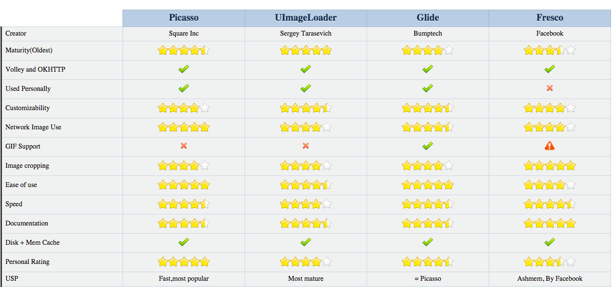

####Universal Image Loader
一个强大的图片加载库，包含各种各样的配置，最老牌，使用也最广泛。

####Picasso
Square出品，必属精品。和OkHttp搭配起来更配呦！

####Volley ImageLoader
Google官方出品，可惜不能加载本地图片~

####Fresco
Facebook出的，天生骄傲！不是一般的强大。

####Glide
Google推荐的图片加载库，专注于流畅的滚动。

>关注效率和内存：Glide
>关注组件大小和图片质量：Picasso

##Part2：MVP（Model-View-Presenter） 

The Model-View-Presenter design pattern is a modern pattern to separate the view from the underlying model. MVP is a derivative of the model–view–controller (MVC) software pattern, also used mostly for building user interfaces.

###原理
- The model is the data that will be displayed in the view (user interface).
- The view is an interface that displays data (the model) and routes user commands (events) to the presenter to act upon that data. The view usually has a reference to its presenter.
- The presenter is the “middle-man” (played by the controller in MVC) and has references to both, view and model. Please note that the word “Model” is not correct. It should rather be business logic that retrieves or manipulates a Model For instance: If you have a database with User and your View wants to display a list of User, then the Presenter would have a reference to your database business logic (like a DAO) from where the presenter will query a list of Users.
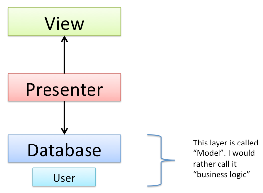

A concrete workflow of querying and displaying a list of users from a database could work like this:

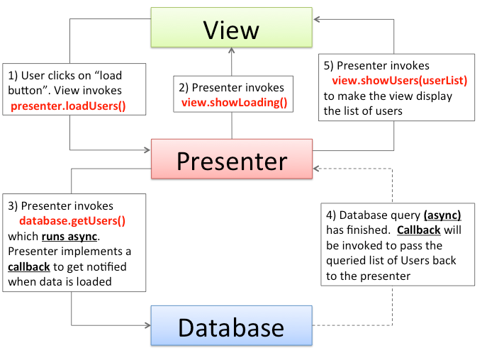


The workflow Image shown above should be self-explaining. However here are some additional thoughts:

- The Presenter is not a OnClickListener. The View is responsible for handling user input and invoking the corresponding method of the presenter. Why not eliminating this “forwarding” process by making the Presenter an OnClickListener? If doing so the presenter needs to have knowledge about views internals. For instance, if a View has two buttons and the view registers the Presenter as OnClickListener on both, how could the Presenter distinguish which button has been clicked on a click event (without knowing views internals like the references to the button)? Model, View and Presenter should be decoupled. Furthermore, by letting Presenter implement OnClickListener the Presenter is bound to the android platform. In theory the presenter and business logic could be plain old java code, which could be shared with a desktop application or any other java application.
- The View is only doing what the Presenter tells the View to do like you can see in step 1 and step 2: After the user has clicked on the “load user button” (step 1) the view doesn’t show the loading animation directly. It’s the presenter (step 2) who explicitly tells the view to show the loading animation. This variant of Model-View-Presenter is called MVP Passive View. The view should be as dumb as possible. Let the presenter control the view in an abstract way. For instance: presenter invokes view.showLoading() but presenter should not control view specific things like animations. So presenter should not invoke methods like view.startAnimation() etc.
- By implementing MVP Passive View it’s much easier to handle concurrency and multithreading. Like you can see in step 3 the database query runs async an the presenter is a Listener / Observer and gets notified when data is ready to display.


###Sample

参见：https://github.com/antoniolg/androidmvp


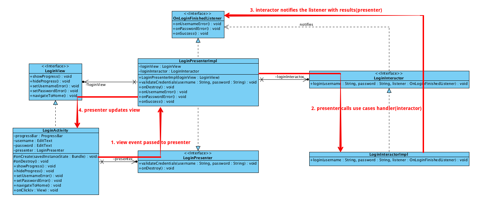


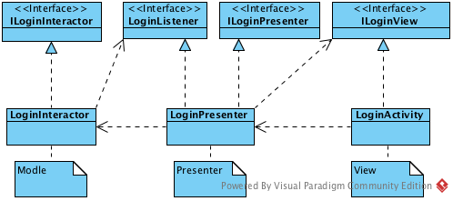


##Part3：MVC


###原理

MVC全名是Model View Controller，如图，是模型(model)－视图(view)－控制器(controller)的缩写，一种软件设计典范，用一种业务逻辑、数据、界面显示分离的方法组织代码，在改进和个性化定制界面及用户交互的同时，不需要重新编写业务逻辑。

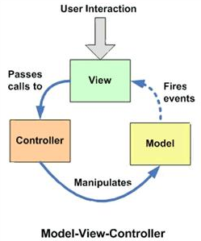


其中M层处理数据，业务逻辑等；V层处理界面的显示结果；C层起到桥梁的作用，来控制V层和M层通信以此来达到分离视图显示和业务逻辑层。

###Android中的MVC

Android中界面部分也采用了当前比较流行的MVC框架，在Android中：

- 视图层(View)
一般采用XML文件进行界面的描述，这些XML可以理解为AndroidApp的View。使用的时候可以非常方便的引入。同时便于后期界面的修改。逻辑中与界面对应的id不变化则代码不用修改，大大增强了代码的可维护性。

- 控制层(Controller)
Android的控制层的重任通常落在了众多的Activity的肩上。这句话也就暗含了不要在Activity中写代码，要通过Activity交割Model业务逻辑层处理，这样做的另外一个原因是Android中的Actiivity的响应时间是5s，如果耗时的操作放在这里，程序就很容易被回收掉。

- 模型层(Model)
我们针对业务模型，建立的数据结构和相关的类，就可以理解为AndroidApp的Model，Model是与View无关，而与业务相关的（感谢@Xander的讲解）。对数据库的操作、对网络等的操作都应该在Model里面处理，当然对业务计算等操作也是必须放在的该层的。就是应用程序中二进制的数据。

###Sample

Controller
```java

public class MainActivity extends ActionBarActivity implements OnWeatherListener, View.OnClickListener {

    private WeatherModel weatherModel;
    private EditText cityNOInput;
    private TextView city;
    ...

    @Override
    protected void onCreate(Bundle savedInstanceState) {
        super.onCreate(savedInstanceState);
        setContentView(R.layout.activity_main);
        weatherModel = new WeatherModelImpl();
        initView();
    }

    //初始化View
    private void initView() {
        cityNOInput = findView(R.id.et_city_no);
        city = findView(R.id.tv_city);
        ...
        findView(R.id.btn_go).setOnClickListener(this);
    }

    //显示结果
    public void displayResult(Weather weather) {
        WeatherInfo weatherInfo = weather.getWeatherinfo();
        city.setText(weatherInfo.getCity());
        ...
    }

    @Override
    public void onClick(View v) {
        switch (v.getId()) {
            case R.id.btn_go:
                weatherModel.getWeather(cityNOInput.getText().toString().trim(), this);
                break;
        }
    }

    @Override
    public void onSuccess(Weather weather) {
        displayResult(weather);
    }

    @Override
    public void onError() {
        Toast.makeText(this, 获取天气信息失败, Toast.LENGTH_SHORT).show();
    }

    private T findView(int id) {
        return (T) findViewById(id);
    }
}
```

从上面代码可以看到，Activity持有了WeatherModel模型的对象，当用户有点击Button交互的时候，Activity作为Controller控制层读取View视图层EditTextView的数据，然后向Model模型发起数据请求，也就是调用WeatherModel对象的方法 getWeather（）方法。当Model模型处理数据结束后，通过接口OnWeatherListener通知View视图层数据处理完毕，View视图层该更新界面UI了。然后View视图层调用displayResult（）方法更新UI。至此，整个MVC框架流程就在Activity中体现出来了。

Model模型

```java
public interface WeatherModel {
    void getWeather(String cityNumber, OnWeatherListener listener);
}
```
```java
public class WeatherModelImpl implements WeatherModel {
    /*这部分代码范例有问题，网络访问不应该在Model中，应该把网络访问换成从数据库读取*/
    @Override
    public void getWeather(String cityNumber, final OnWeatherListener listener) {

        /*数据层操作*/
        VolleyRequest.newInstance().newGsonRequest(http://www.weather.com.cn/data/sk/ + cityNumber + .html,
                Weather.class, new Response.Listener<weather>() {
                    @Override
                    public void onResponse(Weather weather) {
                        if (weather != null) {
                            listener.onSuccess(weather);
                        } else {
                            listener.onError();
                        }
                    }
                }, new Response.ErrorListener() {
                    @Override
                    public void onErrorResponse(VolleyError error) {
                        listener.onError();
                    }
                });
    }
}
```
以上代码看出，这里设计了一个WeatherModel模型接口，然后实现了接口WeatherModelImpl类。controller控制器activity调用WeatherModelImpl类中的方法发起网络请求，然后通过实现OnWeatherListener接口来获得网络请求的结果通知View视图层更新UI 。至此，Activity就将View视图显示和Model模型数据处理隔离开了。activity担当contronller完成了model和view之间的协调作用。

至于这里为什么不直接设计成类里面的一个getWeather（）方法直接请求网络数据？你考虑下这种情况：现在代码中的网络请求是使用Volley框架来实现的，如果哪天老板非要你使用Afinal框架实现网络请求，你怎么解决问题？难道是修改 getWeather（）方法的实现？ no no no，这样修改不仅破坏了以前的代码，而且还不利于维护， 考虑到以后代码的扩展和维护性，我们选择设计接口的方式来解决着一个问题，我们实现另外一个WeatherModelWithAfinalImpl类，继承自WeatherModel，重写里面的方法，这样不仅保留了以前的WeatherModelImpl类请求网络方式，还增加了WeatherModelWithAfinalImpl类的请求方式。Activity调用代码无需要任何修改。


###MVC 与 MVP区别

当我们将Activity复杂的逻辑处理移至另外的一个类（Presenter）中时，Activity其实就是MVP模式中的View，它负责UI元素的初始化，建立UI元素与Presenter的关联（Listener之类），同时自己也会处理一些简单的逻辑（复杂的逻辑交由 Presenter处理）。

MVP的Presenter是框架的控制者，承担了大量的逻辑操作，而MVC的Controller更多时候承担一种转发的作用。因此在App中引入MVP的原因，是为了将此前在Activty中包含的大量逻辑操作放到控制层中，避免Activity的臃肿。

两种模式的主要区别：

- （最主要区别）View与Model并不直接交互，而是通过与Presenter交互来与Model间接交互。而在MVC中View可以与Model直接交互
- 通常View与Presenter是一对一的，但复杂的View可能绑定多个Presenter来处理逻辑。而Controller是基于行为的，并且可以被多个View共享，Controller可以负责决定显示哪个View
- Presenter与View的交互是通过接口来进行的，更有利于添加单元测试。

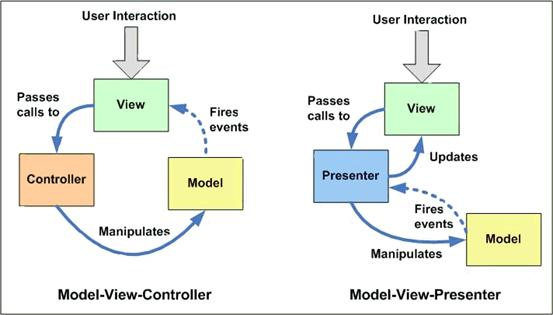


因此我们可以发现MVP的优点如下：
- 模型与视图完全分离，我们可以修改视图而不影响模型；
- 可以更高效地使用模型，因为所有的交互都发生在一个地方——Presenter内部；
- 我们可以将一个Presenter用于多个视图，而不需要改变Presenter的逻辑。这个特性非常的有用，因为视图的变化总是比模型的变化频繁；
- 如果我们把逻辑放在Presenter中，那么我们就可以脱离用户接口来测试这些逻辑（单元测试）。


具体到Android App中，一般可以将App根据程序的结构进行纵向划分，根据MVP可以将App分别为模型层(M)，UI层(V)和逻辑层(P)。

UI层一般包括Activity，Fragment，Adapter等直接和UI相关的类，UI层的Activity在启动之后实例化相应的Presenter，App的控制权后移，由UI转移到Presenter，两者之间的通信通过BroadCast、Handler或者接口完成，只传递事件和结果。

举个简单的例子，UI层通知逻辑层（Presenter）用户点击了一个Button，逻辑层（Presenter）自己决定应该用什么行为进行响应，该找哪个模型（Model）去做这件事，最后逻辑层（Presenter）将完成的结果更新到UI层。


>备注：Android本身采用的就是MVC模式，所以没有必要在刻意用MVC架构了


##Part4：MVVM

###原理
MVVM可以算是MVP的升级版，其中的VM是ViewModel的缩写，ViewModel可以理解成是View的数据模型和Presenter的合体，ViewModel和View之间的交互通过Data Binding完成，而Data Binding可以实现双向的交互，这就使得视图和控制层之间的耦合程度进一步降低，关注点分离更为彻底，同时减轻了Activity的压力。

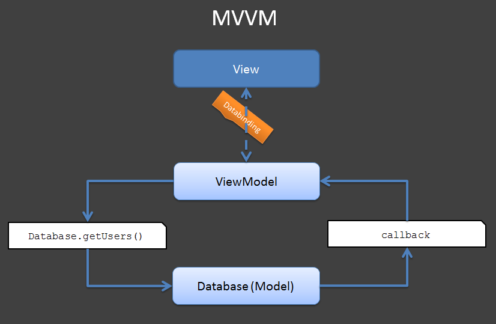

在比较之前，先从图上看看三者的异同。

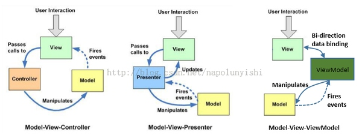


刚开始理解这些概念的时候认为这几种模式虽然都是要将view和model解耦，但是非此即彼，没有关系，一个应用只会用一种模式。后来慢慢发现世界绝对不是只有黑白两面，中间最大的一块其实是灰色地带，同样，这几种模式的边界并非那么明显，可能你在自己的应用中都会用到。实际上也根本没必要去纠结自己到底用的是MVC、MVP还是MVVP，不管黑猫白猫，捉住老鼠就是好猫。

###Sample

参见：https://developer.android.com/intl/zh-cn/tools/data-binding/guide.html

Layout
```xml
<?xml version="1.0" encoding="utf-8"?>
<layout xmlns:android="http://schemas.android.com/apk/res/android">
   <data>
       <variable name="user" type="com.example.User"/>
   </data>
   <LinearLayout
       android:orientation="vertical"
       android:layout_width="match_parent"
       android:layout_height="match_parent">
       <TextView android:layout_width="wrap_content"
           android:layout_height="wrap_content"
           android:text="@{user.firstName}"/>
       <TextView android:layout_width="wrap_content"
           android:layout_height="wrap_content"
           android:text="@{user.lastName}"/>
   </LinearLayout>
</layout>
```
Data Object

Let’s assume for now that you have a plain-old Java object (POJO) for User:
```java
public class User {
   public final String firstName;
   public final String lastName;
   public User(String firstName, String lastName) {
       this.firstName = firstName;
       this.lastName = lastName;
   }
}
This type of object has data that never changes. It is common in applications to have data that is read once and never changes thereafter. It is also possible to use a JavaBeans objects:

public class User {
   private final String firstName;
   private final String lastName;
   public User(String firstName, String lastName) {
       this.firstName = firstName;
       this.lastName = lastName;
   }
   public String getFirstName() {
       return this.firstName;
   }
   public String getLastName() {
       return this.lastName;
   }
}
```
From the perspective of data binding, these two classes are equivalent. The expression @{user.firstName} used for the TextView’s android:text attribute will access the firstName field in the former class and the getFirstName() method in the latter class. Alternatively, it will also be resolved to firstName() if that method exists.

Binding Data

By default, a Binding class will be generated based on the name of the layout file, converting it to Pascal case and suffixing “Binding” to it. The above layout file was main_activity.xml so the generate class was MainActivityBinding. This class holds all the bindings from the layout properties (e.g. the user variable) to the layout’s Views and knows how to assign values for the binding expressions.The easiest means for creating the bindings is to do it while inflating:
```java
@Override
protected void onCreate(Bundle savedInstanceState) {
   super.onCreate(savedInstanceState);
   MainActivityBinding binding = DataBindingUtil.setContentView(this, R.layout.main_activity);
   User user = new User("Test", "User");
   binding.setUser(user);
}
```

###MVC->MVP->MVVM演进过程

MVC -> MVP -> MVVM 这几个软件设计模式是一步步演化发展的，MVVM 是从 MVP 的进一步发展与规范，MVP 隔离了MVC中的 M 与 V 的直接联系后，靠 Presenter 来中转，所以使用 MVP 时 P 是直接调用 View 的接口来实现对视图的操作的，这个 View 接口的东西一般来说是 showData、showLoading等等。M 与 V已经隔离了，方便测试了，但代码还不够优雅简洁，所以 MVVM 就弥补了这些缺陷。在 MVVM 中就出现的 Data Binding 这个概念，意思就是 View 接口的 showData 这些实现方法可以不写了，通过 Binding 来实现。


三者的差异在于如何粘合View和Model，实现用户的交互操作以及变更通知

- Controller（MVC）
Controller接收View的操作事件，根据事件不同，或者调用Model的接口进行数据操作，或者进行View的跳转，从而也意味着一个Controller可以对应多个View。Controller对View的实现不太关心，只会被动地接收，Model的数据变更不通过Controller直接通知View，通常View采用观察者模式监听Model的变化。

- Presenter（MVP）
Presenter与Controller一样，接收View的命令，对Model进行操作；与Controller不同的是Presenter会反作用于View，Model的变更通知首先被Presenter获得，然后Presenter再去更新View。一个Presenter只对应于一个View。根据Presenter和View对逻辑代码分担的程度不同，这种模式又有两种情况：Passive View和Supervisor Controller。

- ViewModel（MVVM）
注意这里的“Model”指的是View的Model，跟MVVM中的一个Model不是一回事。所谓View的Model就是包含View的一些数据属性和操作的这么一个东东，这种模式的关键技术就是数据绑定（data binding），View的变化会直接影响ViewModel，ViewModel的变化或者内容也会直接体现在View上。这种模式实际上是框架替应用开发者做了一些工作，开发者只需要较少的代码就能实现比较复杂的交互。


##Part5：Clean Architecture

clean architecture：stands for a group of practices that produce systems that are:

- Independent of Frameworks.
- Testable.
- Independent of UI.
- Independent of Database.
- Independent of any external agency.**

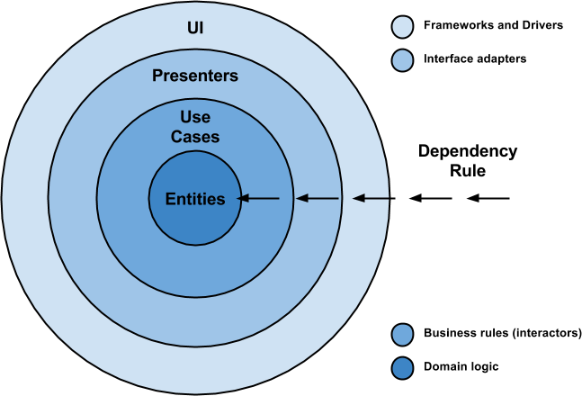

It is not a must to use only 4 circles (as you can see in the picture), because they are only schematic but you should take into consideration the Dependency Rule: source code dependencies can only point inwards and nothing in an inner circle can know anything at all about something in an outer circle.

Here is some vocabulary that is relevant for getting familiar and understanding this approach in a better way:

- **Entities**: These are the business objects of the application.
- **Use Cases**: These use cases orchestrate the flow of data to and from the entities. Are also called Interactors.
- **Interface Adapters**: This set of adapters convert data from the format most convenient for the use cases and entities. Presenters and Controllers belong here.
- **Frameworks and Drivers**: This is where all the details go: UI, tools, frameworks, etc.


The objective is the separation of concerns by keeping the business rules not knowing anything at all about the outside world, thus, they can can be tested without any dependency to any external element.
To achieve this, my proposal is about breaking up the project into 3 different layers, in which each one has its own purpose and works separately from the others.
It is worth mentioning that each layer uses its own data model so this independence can be reached (you will see in code that a data mapper is needed in order to accomplish data transformation, a price to be paid if you do not want to cross the use of your models over the entire application).
Here is an schema so you can see how it looks like:

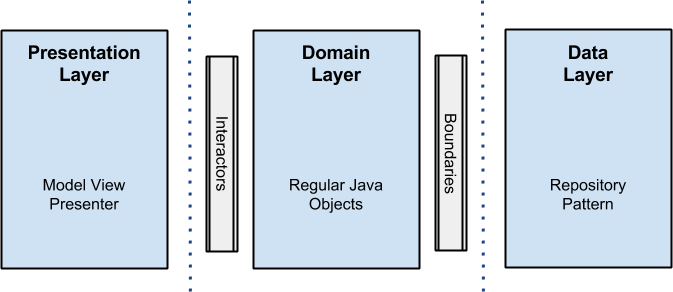


NOTE: I did not use any external library (except gson for parsing json data and junit, mockito, robolectric and espresso for testing). The reason was because it made the example a bit more clear. Anyway do not hesitate to add ORMs for storing disk data or any dependency injection framework or whatever tool or library you are familiar with, that could make your life easier. (Remember that reinventing the wheel is not a good practice).


###Presentation Layer
Is here, where the logic related with views and animations happens. It uses no more than a Model View Presenter (MVP from now on), but you can use any other pattern like MVC or MVVM. I will not get into details on it, but here fragments and activities are only views, there is no logic inside them other than UI logic, and this is where all the rendering stuff takes place.
Presenters in this layer are composed with interactors (use cases) that perform the job in a new thread outside the android UI thread, and come back using a callback with the data that will be rendered in the view.

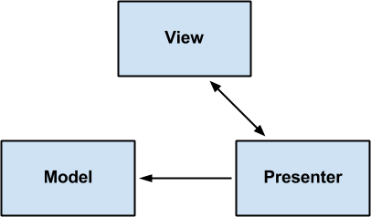

>这里比较灵活，可采用各种模式，如MVP、MVVM、MVC等，也可用不模式

###Domain Layer
Business rules here: all the logic happens in this layer. Regarding the android project, you will see all the interactors (use cases) implementations here as well.
This layer is a pure java module without any android dependencies. All the external components use interfaces when connecting to the business objects.

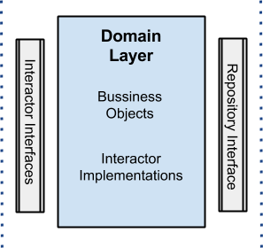


>这里用来装业务逻辑，和BLL根据相似

###Data Layer
All data needed for the application comes from this layer through a UserRepository implementation (the interface is in the domain layer) that uses a Repository Pattern with a strategy that, through a factory, picks different data sources depending on certain conditions.
For instance, when getting a user by id, the disk cache data source will be selected if the user already exists in cache, otherwise the cloud will be queried to retrieve the data and later save it to the disk cache.
The idea behind all this is that the data origin is transparent for the client, which does not care if the data is coming from memory, disk or the cloud, the only truth is that the data will arrive and will be got.

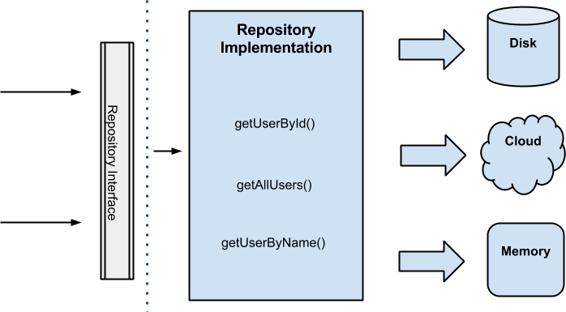


>这个层用来处理数据存储问题，使用Repository模式实现数据源的封装

###Error Handling
This is always a topic for discussion and could be great if you share your solutions here.
My strategy was to use callbacks, thus, if something happens in the data repository for example, the callback has 2 methods onResponse() and onError(). The last one encapsulates exceptions in a wrapper class called “ErrorBundle”: This approach brings some difficulties because there is a chains of callbacks one after the other until the error goes to the presentation layer to be rendered. Code readability could be a bit compromised.

>使用callback方式也处理异常，并不合适，导致异常处理链较长，不好用。可考虑使用EventBus来分发

##Part6：Tips
###1、子线程回调更新UI问题
**问题描述**：

通过定义回调接口，然后在子线中进行回调，实现状态通知。例如网络请求时，在请求线程中进行回调onSuccess、onError等，由于是在子线程调用的，回调方法也是在子线程运行。如果在回调中更新UI，此时实际上是在子线程中更新UI，可能会引发异常。

**处理方法**：
处理方式有以下三种，前两种利用主线程的Handler，后一种利用RxJava框架。（这里只是提供三种方案，当然还有其它方案，如利用EventBus）

方法一：在子线程中传入主线程的Handler，在需要进行回调的地方，调用Handler.postMessage方法进行通知。在Handler的handlerMessage方法中，进行回调，此时，回调方法是在主线程中执行

Sample:

```java
package com.xhr.mvpdemo.repository;

import android.os.Handler;
import android.os.Looper;
import android.os.Message;

/**
 * Created by xhrong on 2016/1/12.
 *
 * 这个类提供了一种解决子线程中执行回调更新UI的实现模式。即线程中调用sendMessage，回调类通过Handler中转，实现子线种与UI线程的切换。
 */
public abstract class OnUserRepoListener {

    private Handler handler;
    protected static final int SUCCESS_MESSAGE = 0;
    protected static final int FAILURE_MESSAGE = 1;


    public abstract void onSuccess();

    public abstract void onFail();

    public OnUserRepoListener() {
        //通过handler实现子线程和主线程的切换
        handler = new ResponderHandler (this, Looper.myLooper());
    }


    /**
     * Helper method to create Message instance from handler
     *
     * @param responseMessageId   constant to identify Handler message
     * @param responseMessageData object to be passed to message receiver
     * @return Message instance, should not be null
     */
    protected Message obtainMessage(int responseMessageId, Object responseMessageData) {
        return Message.obtain(handler, responseMessageId, responseMessageData);
    }


    final public void sendSuccessMessage() {
        sendMessage(obtainMessage(SUCCESS_MESSAGE, null));
    }

    final public void sendFailMessage() {
        sendMessage(obtainMessage(FAILURE_MESSAGE, null));
    }

    // Methods which emulate android's Handler and Message methods
    protected void handleMessage(Message message) {
        try {
            switch (message.what) {
                case SUCCESS_MESSAGE:
                    onSuccess();
                    break;
                case FAILURE_MESSAGE:
                    onFail();
                    break;
            }
        } catch (Throwable error) {
            onFail();
        }
    }

    protected void sendMessage(Message msg) {
        if (handler != null && !Thread.currentThread().isInterrupted()) { // do not send messages if request has been cancelled
            handler.sendMessage(msg);
        }
    }


    /**
     * Avoid leaks by using a non-anonymous handler class.
     */
    private static class ResponderHandler extends Handler {
        private final OnUserRepoListener mResponder;

        ResponderHandler(OnUserRepoListener mResponder, Looper looper) {
            super(looper);
            this.mResponder = mResponder;
        }

        @Override
        public void handleMessage(Message msg) {
            mResponder.handleMessage(msg);
        }
    }
}
```

```java

package com.xhr.mvpdemo.repository.datasource;

import android.os.Handler;
import android.os.Looper;
import android.util.Log;

import com.xhr.mvpdemo.repository.OnUserRepoListener;
import com.xhr.mvpdemo.repository.UserEntity;

import java.util.concurrent.ExecutorService;
import java.util.concurrent.Executors;

public class MemoryUserDataStore implements UserDataStore {
    ExecutorService executor = Executors.newFixedThreadPool(3);
    Handler mHandler = new Handler();

    @Override
    public void getUser(final String userName, final OnUserRepoListener listener) {
        new Thread(new Runnable() {
            @Override
            public void run() {
                if (Looper.myLooper() == Looper.getMainLooper())
                    Log.e("MemoryUserDataStore.getUser", "MainThread");
                else
                    Log.e("MemoryUserDataStore.getUser", "SubThread");
                UserEntity entity = null;
                if (userName.contains("2")) {
                    entity = new UserEntity();
                    entity.setPassword("111");
                    entity.setUserName(userName);
                    //调用handler的postMessage通知回调
                    listener.sendSuccessMessage();
                } else {
                    listener.sendFailMessage();
            }
        }).start();
    }

    @Override
    public void userExist(String userName, OnUserRepoListener listener) {
        if (userName.contains("2"))
            listener.onSuccess();
        listener.onFail();
    }
}

```
>AsycHttpClient组件采取这种实现方法，效果较好。但也存在一个小问题，即OnRepoListener不是接口，而是抽象类，和一般的理解不太一致。


方法二：在子线程中传入主线程的Handler，在需要进行回调的地方，调用Handler.post方法，在post方法内执行回调，此时，回调方法也是在主线程执行

Sample:

```java
package com.xhr.mvpdemo.repository;

/**
 * Created by xhrong on 2016/1/12.
 */
public interface OnUserRepoListener {
    public  void onSuccess();

    public  void onFail();
}

```

```java
package com.xhr.mvpdemo.repository.datasource;

import android.os.Handler;
import android.os.Looper;
import android.util.Log;

import com.xhr.mvpdemo.delivery.MessageDelivery;
import com.xhr.mvpdemo.repository.OnUserRepoListener;
import com.xhr.mvpdemo.repository.UserEntity;

public class MemoryUserDataStore implements UserDataStore {

    private MessageDelivery messageDelivery;

    public MemoryUserDataStore(MessageDelivery messageDelivery) {
        this.messageDelivery = messageDelivery;
    }

    @Override
    public void getUser(final String userName, final OnUserRepoListener listener) {
        new Thread(new Runnable() {
            @Override
            public void run() {
                if (Looper.myLooper() == Looper.getMainLooper())
                    Log.e("MemoryUserDataStore.getUser", "MainThread");
                else
                    Log.e("MemoryUserDataStore.getUser", "SubThread");
                UserEntity entity = null;
                if (userName.contains("2")) {
                    entity = new UserEntity();
                    entity.setPassword("111");
                    entity.setUserName(userName);
                    //回调
                    messageDelivery.deliveryMessage(new Runnable() {
                        @Override
                        public void run() {
                            listener.onSuccess();
                        }
                    });
                } else {
                    messageDelivery.deliveryMessage(new Runnable() {
                        @Override
                        public void run() {
                            listener.onSuccess();
                        }
                    });
                }
            }
        }).start();
    }

    @Override
    public void userExist(String userName, OnUserRepoListener listener) {
        if (userName.contains("2"))
            listener.onSuccess();
        listener.onFail();
    }
}

```

```java
package com.xhr.mvpdemo.delivery;

import android.os.Handler;
import android.os.Looper;

/**
 * Created by xhrong on 2016/1/14.
 */
public class MessageDelivery {

    private Handler mHandler;

    public MessageDelivery() {
        this(new Handler(Looper.getMainLooper()));
    }

    public MessageDelivery(Handler handler) {
        mHandler = handler;
    }

    public void deliveryMessage(Runnable runnable) {
        if (mHandler != null)
            mHandler.post(runnable);
    }
}
```

```java

public class UserDataStoreFactory {

    public UserDataStoreFactory() {

    }

    /**
     * Create {@link UserDataStore} from a user id.
     */
    public UserDataStore create(Class clazz) {
        UserDataStore userDataStore=null;

        Log.e("UserDataStoreFactory getName", clazz.getName());
        if(clazz==MemoryUserDataStore.class){
            userDataStore=new MemoryUserDataStore(new MessageDelivery());
        }else {
          //  userDataStore=new DiskUserDataStore();
        }

        return userDataStore;
    }

}
```
>该方法将Handler与接口定义分离，并通过工厂类传递给子线程，相对比较复杂。但是保证了回调接口可以使用常规的接口进行定义，符合一般习惯。Volley采用这种方式。

方法三：利用RxJava实现线程切换。

Sample

```java
   Observable.just(userName)
                .map(new Func1<String, User>() {
                    @Override
                    public User call(String s) {//这里在子线程中运行
                        if (Looper.myLooper() == Looper.getMainLooper())
                            Log.e("MemoryUserDataStore.getUser", "MainThread");
                        else
                            Log.e("MemoryUserDataStore.getUser", "SubThread");
                        if (s.equals("xhrong")) {
                            User user = new User();
                            user.login = "test";
                            user.email = "test";
                            user.id = 0;
                            return user;
                        } else return null;
                    }
                })
                .subscribeOn(Schedulers.newThread())
                .observeOn(AndroidSchedulers.mainThread())
                .subscribe(new Subscriber<User>() {//这里在主线程中运行
                    @Override
                    public void onCompleted() {

                    }

                    @Override
                    public void onError(Throwable e) {
                        listener.onFail();
                    }

                    @Override
                    public void onNext(User s) {
                        if (Looper.myLooper() == Looper.getMainLooper())
                            Log.e("MemoryUserDataStore.getUser", "MainThread");
                        else
                            Log.e("MemoryUserDataStore.getUser", "SubThread");
                        listener.onSuccess();
                    }
                });

```

###2、Future模式的问题

Future模式可以实现以下两个主要功能：
- 子线程和主线程切换
- 子线程向主线程回传数据

但是存在以下问题：
Future.get()方法会阻塞主线程，虽然可以设置超时，但是超时时间很难把握。

```java
        Future future = this.userDataStore.getUser(userName, listener);
        try {
            //设置超时，最多等待15s。在此期间UI线程被阻塞。-----所以，Future并不常用。
            UserEntity userEntity = (UserEntity) future.get(15000, TimeUnit.MILLISECONDS);
            return userEntity;
        } catch (Exception ex) {
            ex.printStackTrace();
            return null;
        }
```
>建议：不要使用Future考虑使用Tips1中的方法替代
